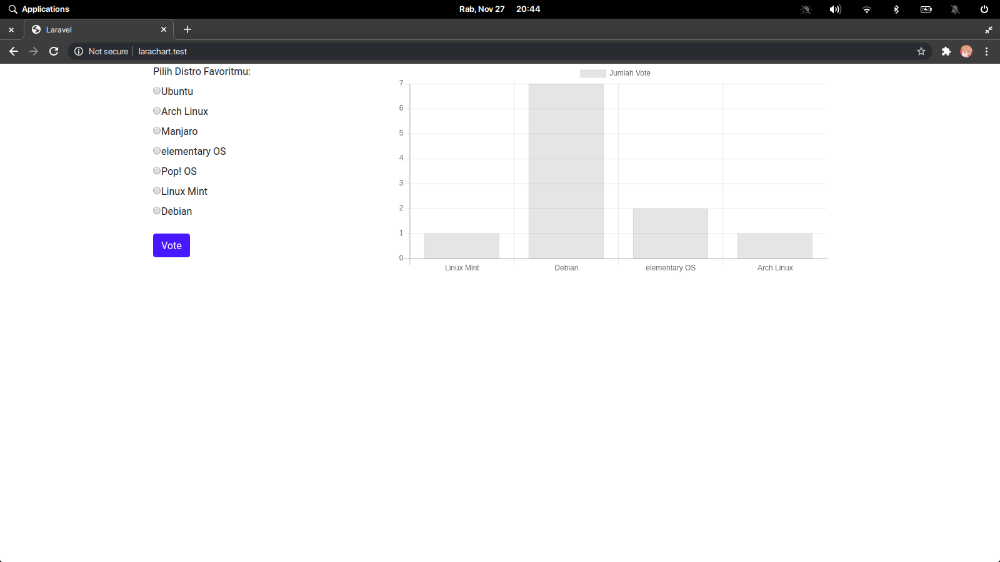

	<h1>Larachartjs</h1>
	
Web vote distro favorit dengan menggunakan laravel + chart js dan di deploy dengan CI/CD ke heroku.

	
	Demo <a href="https://agile-sierra-42926.herokuapp.com">https://agile-sierra-42926.herokuapp.com</a>

##Instalasi
- `git clone https://github.com/reorr/laracharjs`
- `cd larachartjs`
- `composer install`
- `php artisan key:generate`
- atur database sesuai mesin masing-masing
- `php artisan migrate`
- `php artisan serve`
